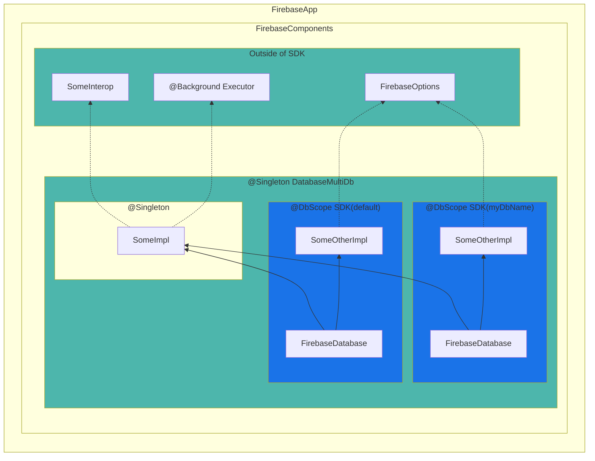

# Dependency Injection

While [Firebase Components]({{ site.baseurl }}) provides basic
Dependency Injection capabilities for interop between Firebase SDKs, it's not ideal as a general purpose
DI framework for a few reasons, to name some:

* It's verbose, i.e. requires manually specifying dependencies and constructing instances of components in Component
  definitions.
* It has a runtime cost, i.e. initialization time is linear in the number of Components present in the graph

As a result using [Firebase Components]({{ site.baseurl }}) is appropriate only
for inter-SDK injection and scoping instances per `FirebaseApp`.

On the other hand, manually instantiating SDKs is often tedious, errorprone, and leads to code smells
that make code less testable and couples it to the implementation rather than the interface. For more context see
[Dependency Injection](https://en.wikipedia.org/wiki/Dependency_injection) and  [Motivation](https://github.com/google/guice/wiki/Motivation).

{: .important }
It's recommended to use [Dagger](https://dagger.dev) for internal dependency injection within the SDKs and
[Components]({{ site.baseurl }}) to inject inter-sdk dependencies that are available only at
runtime into the [Dagger Graph](https://dagger.dev/dev-guide/#building-the-graph) via
[builder setters](https://dagger.dev/dev-guide/#binding-instances) or [factory arguments](https://dagger.dev/api/latest/dagger/Component.Factory.html).

See: [Dagger docs](https://dagger.dev)
See: [Dagger tutorial](https://dagger.dev/tutorial/)

{: .highlight }
While Hilt is the recommended way to use dagger in Android applications, it's not suitable for SDK/library development.

## How to get started

Since [Dagger](https://dagger.dev) does not strictly follow semver and requires the dagger-compiler version to match the dagger library version,
it's not safe to depend on it via a pom level dependency, see [This comment](https://github.com/firebase/firebase-android-sdk/issues/1677#issuecomment-645669608) for context. For this reason in Firebase SDKs we "vendor/repackage" Dagger into the SDK itself under
`com.google.firebase.{sdkname}.dagger`. While it incurs in a size increase, it's usually on the order of a couple of KB and is considered
negligible.

To use Dagger in your SDK use the following in your Gradle build file:

```groovy
plugins {
    id("firebase-vendor")
}

dependencies {
    implementation(libs.javax.inject)
    vendor(libs.dagger.dagger) {
        exclude group: "javax.inject", module: "javax.inject"
    }
    annotationProcessor(libs.dagger.compiler)
}
```

## General Dagger setup

As mentioned in [Firebase Components]({{ site.baseurl }}), all components are scoped per `FirebaseApp`
meaning there is a single instance of the component within a given `FirebaseApp`.

This makes it a natural fit to get all inter-sdk dependencies and instatiate the Dagger component inside the `ComponentRegistrar`.

```kotlin
class MyRegistrar : ComponentRegistrar {
  override fun getComponents() = listOf(
    Component.builder(MySdk::class.java)
      .add(Dependency.required(FirebaseOptions::class.java))
      .add(Dependency.optionalProvider(SomeInteropDep::class.java))
      .factory(c -> DaggerMySdkComponent.builder()
        .setFirebaseApp(c.get(FirebaseApp::class.java))
        .setSomeInterop(c.getProvider(SomeInteropDep::class.java))
        .build()
        .getMySdk())
      .build()
}
```

Here's a simple way to define the dagger component:

```kotlin
@Component(modules = MySdkComponent.MainModule::class)
@Singleton
interface MySdkComponent {
  // Informs dagger that this is one of the types we want to be able to create
  // In this example we only care about MySdk
  fun getMySdk() : MySdk

  // Tells Dagger that some types are not available statically and in order to create the component
  // it needs FirebaseApp and Provider<SomeInteropDep>
  @Component.Builder
  interface Builder {
    @BindsInstance fun setFirebaseApp(app: FirebaseApp)
    @BindsInstance fun setSomeInterop(interop: com.google.firebase.inject.Provider<SomeInteropDep>)
    fun build() : MySdkComponent
  }

  @Module
  interface MainModule {
    // define module @Provides and @Binds here
  }
}
```

The only thing left to do is to properly annotate `MySdk`:

```kotlin
@Singleton
class MySdk @Inject constructor(app: FirebaseApp, interopAdapter: MySdkAdapter) {
    fun someMethod() {
        interopAdapter.doInterop()
    }
}

@Singleton
class MySdkInteropAdapter @Inject constructor(private val interop: com.google.firebase.inject.Provider<SomeInteropDep>) {
    fun doInterop() {
        interop.get().doStuff()
    }
}
```

## Scope

Unlike Component, Dagger does not use singleton scope by default and instead injects a new instance of a type at each injection point,
in the example above we want `MySdk` and `MySdkInteropAdapter` to be singletons so they are are annotated with `@Singleton`.

See [Scoped bindings](https://dagger.dev/dev-guide/#singletons-and-scoped-bindings) for more details.

### Support multiple instances of the SDK per `FirebaseApp`(multi-resource)

As mentioned in [Firebase Components]({{ site.baseurl }}), some SDKs support multi-resource mode,
which effectively means that there are 2 scopes at play:

1. `@Singleton` scope that the main `MultiResourceComponent` has.
2. Each instance of the sdk will have its own scope.



As you can see above, `DatabaseMultiDb` and `SomeImpl` are singletons, while `FirebaseDatabase` and `SomeOtherImpl` are scoped per `database name`.

It can be easily achieved with the help of [Dagger's subcomponents](https://dagger.dev/dev-guide/subcomponents).

For example:

```kotlin
@Scope
annotation class DbScope

@Component(modules = DatabaseComponent.MainModule::class)
interface DatabaseComponent {
    fun getMultiDb() : DatabaseMultiDb

    @Component.Builder
    interface Builder {
        // usual setters for Firebase component dependencies
        // ...
        fun build() : DatabaseComponent
    }

    @Module(subcomponents = DbInstanceComponent::class)
    interface MainModule {}

    @Subcomponent(modules = DbInstanceComponent.InstanceModule::class)
    @DbScope
    interface DbInstanceComponent {
        fun factory() : Factory

        @Subcomponent.Factory
        interface Factory {
            fun create(@BindsInstance @Named("dbName") dbName: String)
        }
    }

    @Module
    interface InstanceModule {
        // ...
    }
}
```

Annotating `FirebaseDatabase`:

```kotlin
@DbScope
class FirebaseDatabase @Inject constructor(options: FirebaseOptions, @Named dbName: String) {
  // ...
}
```

Implementing `DatabaseMultiDb`:

```kotlin
@Singleton
class DatabaseMultiDb @Inject constructor(private val factory: DbInstanceComponent.Factory) {
  private val instances = mutableMapOf<String, FirebaseDatabase>()
  
  @Synchronized
  fun get(dbName: String) : FirebaseDatabase {
    if (!instances.containsKey(dbName)) {
      mInstances.put(dbName, factory.create(dbName))
    }
    return mInstances.get(dbName);
  }
}
```
