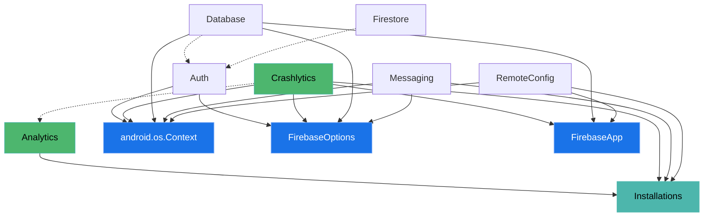

# Firebase Components
{: .no_toc}

1. TOC
{:toc}

Firebase is known for being easy to use and requiring no/minimal configuration at runtime.
Just adding SDKs to the app makes them discover each other to provide additional functionality,
e.g. `Firestore` automatically integrates with `Auth` if present in the app.

* Firebase SDKs have required and optional dependencies on other Firebase SDKs
* SDKs have different initialization requirements, e.g. `Analytics` and `Crashlytics` must be
  initialized upon application startup, while some are initialized on demand only.

To accommodate these requirements Firebase uses a component model that discovers SDKs present in the app,
determines their dependencies and provides them to dependent SDKs via a `Dependency Injection` mechanism.

This page describes the aforementioned Component Model, how it works and why it's needed.

## Design Considerations

### Transparent/invisible to 3p Developers

To provide good developer experience, we don't want developers to think about how SDKs work and interoperate internally.
Instead we want our SDKs to have a simple API surface that hides all of the internal details.
Most products have an API surface that allows developers to get aninstance of a given SDK via `FirebaseFoo.getInstance()`
and start using it right away.

### Simple to use and integrate with for component developers

* The component model is lightweight in terms of integration effort. It is not opinionated on how components are structured.
* The component model should require as little cooperation from components runtime as possible.
* It provides component developers with an API that is easy to use correctly, and hard to use incorrectly.
* Does not sacrifice testability of individual components in isolation

### Performant at startup and initialization

The runtime does as little work as possible during initialization.

## What is a Component?

A Firebase Component is an entity that:

* Implements one or more interfaces
* Has a list of dependencies(required or optional). See [Dependencies]({{ site.baseurl }})
* Has initialization requirements(e.g. eager in default app)
* Defines a factory creates an instance of the component’s interface given it's dependencies.
  (In other words describes how to create the given component.)

Example:

```java
// Defines a component that is registered as both `FirebaseAuth` and `InternalAuthProvider`.
Component<FirebaseAuth> auth = Component.builder(FirebaseAuth.class, InternalAuthProvider.class)
    // Declares dependencies
    .add(Dependency.required(FirebaseOptions.class))
    // Defines a factory
    .factory(container -> new FirebaseAuth(container.get(FirebaseOptions.class)))
    .eagerInDefaultApp() // alwaysEager() or lazy(), lazy is the default.
    .build()
```

All components are singletons within a Component Container(e.g. one instance per FirebaseApp).
There are however SDKs that need the ability to expose multiple objects per FirebaseApp,
for example RTBD(as well as Storage and Firestore) has multidb support which allows developers
to access one or more databases within one FirebaseApp. To address this requirement,
SDKs have to register their components in the following form(or similar):

```java
// This is the singleton holder of different instances of FirebaseDatabase.
interface RtdbComponent {
  FirebaseDatabase getDefault();
  FirebaseDatabase get(String databaseName);
}
```

As you can see in the previous section, components are just values and don't have any behavior per se,
essentially they are just blueprints of how to create them and what dependencies they need.

So there needs to be some ComponentRuntime that can discover and wire them together into a dependency graph,
in order to do that, there needs to be an agreed upon location where SDKs can register the components they provide.

The next 2 sections describe how it's done.

## Component Registration

In order to define the `Components` an SDK provides, it needs to define a class that implements `ComponentRegistrar`,
this class contains all component definitions the SDK wants to register with the runtime:

```java
public class MyRegistrar implements ComponentRegistrar {
  /// Returns a one or more Components that will be registered in
  /// FirebaseApp and participate in dependency resolution and injection.
  @Override
  public Collection<FirebaseComponent<?>> getComponents() {
    Arrays.asList(Component.builder(MyType.class)
        /* ... */
        .build());
  }
}
```

## Component Discovery

In addition to creating the `ComponentRegistrar` class, SDKs also need to add them to their `AndroidManifest.xml` under `ComponentDiscoveryService`:

```xml
<manifest xmlns:android="http://schemas.android.com/apk/res/android">
  <application>
      <service android:name="com.google.firebase.components.ComponentDiscoveryService"
          android:exported="false">
          <meta-data
              android:name="com.google.firebase.components:com.google.firebase.foo.FirebaseFooRegistrar"
              android:value="com.google.firebase.components.ComponentRegistrar" />
      </service>
  </application>
</manifest>
```

When the final app is built, manifest registrar entries will all end up inside the above `service` as metadata key- value pairs.
At this point `FirebaseApp` will instantiate them and use the `ComponentRuntime` to construct the component graph.

## Dependency resolution and initialization

### Definitions and constraints

* **Component A depends on Component B** if `B` depends on an `interface` that `A` implements.
* **For any Interface I, only one component is allowed to implement I**(with the exception of
  [Set Dependencies]({{ site.baseurl }}#set-dependencies)). If this invariant is violated, the container will
  fail to start at runtime.
* **There must not be any dependency cycles** among components. See Dependency Cycle Resolution on how this limitation can
  be mitigated
* **Components are initialized lazily by default**(unless a component is declared eager) and are initialized when requested
  by an application either directly or transitively.

The initialization phase of the FirebaseApp will consist of the following steps:

1. Get a list of available FirebaseComponents that were discovered by the Discovery mechanism
2. Topologically sort components based on their declared dependencies - failing if a dependency cycle is detected or multiple implementations are registered for any interface.
3. Store a map of {iface -> ComponentFactory} so that components can be instantiated on demand(Note that component instantiation does not yet happen)
4. Initialize EAGER components or schedule them to initialize on device unlock, if in direct boot mode.

### Initialization example

Below is an example illustration of the state of the component graph after initialization:



There are **2 explicitly eager** components in this example: `Crashlytics` and `Analytics`.
These components are initialized when `FirebaseApp` is initialized. `Installations` is initialized eagerly because
eager components depends on it(see Prefer Lazy dependencies to avoid this as mush as possible).
`FirebaseApp`, `FirebaseOptions` and `Android Context` are always present in the Component Container and are considered initialized as well.

*The rest of the components are left uninitialized and will remain so until the client application requests them or an eager
component initializes them by using a Lazy dependency.*
For example, if the application calls `FirebaseDatabase.getInstance()`, the container will initialize `Auth` and `Database`
and will return `Database` to the user.

### Support multiple instances of the SDK per `FirebaseApp`(multi-resource)

Some SDKs support multi-resource mode of operation, where it's possible to create more than one instance per `FirebaseApp`.

Examples:

* RTDB allows more than one database in a single Firebase project, so it's possible to instantiate one instance of the sdk per datbase

```kotlin
val rtdbOne = Firebase.database(app) // uses default database
val rtdbTwo = Firebase.database(app, "dbName")
```

* Firestore, functions, and others support the same usage pattern

To allow for that, such SDKs register a singleton "MultiResource" [Firebase component]({{ site.baseurl }}),
which creates instances per resource(e.g. db name).

Example

```kotlin
class DatabaseComponent(private val app: FirebaseApp, private val tokenProvider: InternalTokenProvider) {
  private val instances: MutableMap<String, FirebaseDatabase> = new HashMap<>();

  @Synchronized
  fun get(dbName: String) : FirebaseDatabase {
    if (!instances.containsKey(dbName)) {
      instances.put(dbName, FirebaseDatabase(app, tokenProvider, dbName))
    }
    return instances.get(dbName);
  }
}

class FirebaseDatabase(
    app: FirebaseApp,
    tokenProvider: InternalTokenProvider,
    private val String dbName)

    companion object {
      fun getInstance(app : FirebaseApp) = getInstance("default")
      fun getInstance(app : FirebaseApp, dbName: String) = 
        app.get(DatabaseComponent::class.java).get("default")
    }

```
