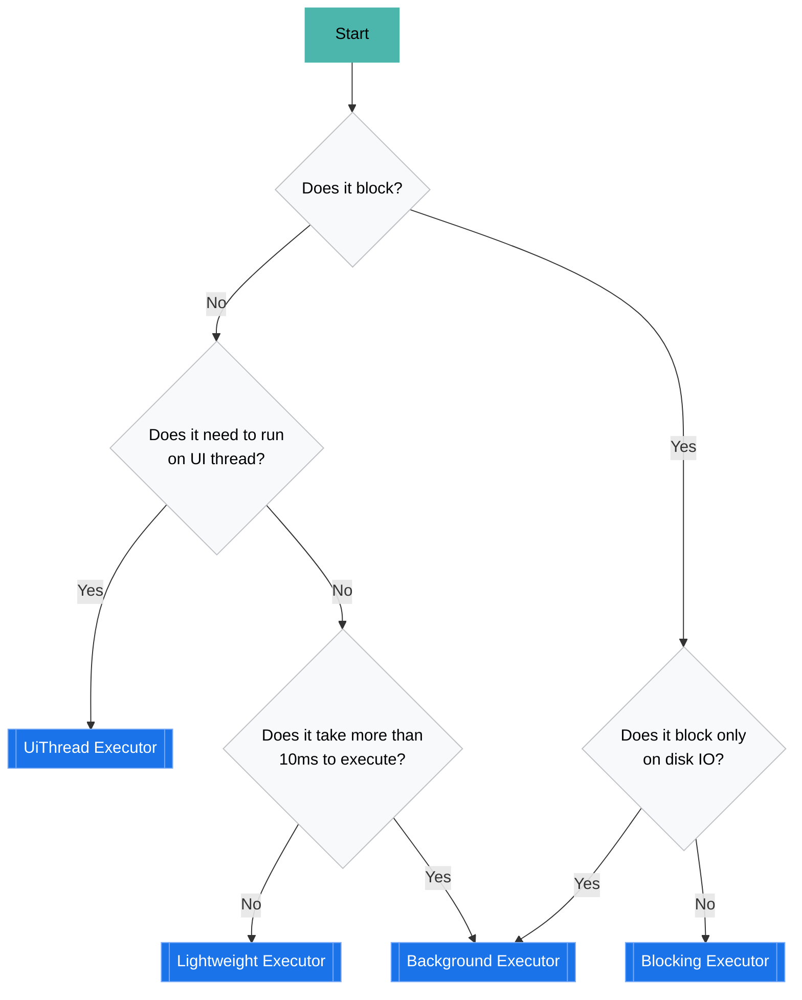

# Executors
{: .no_toc}

1. TOC
{:toc}

## Intro

OS threads are a limited resource that needs to be used with care. In order to minimize the number of threads used by Firebase
as a whole and to increase resource sharing Firebase Common provides a set of standard
[executors](https://developer.android.com/reference/java/util/concurrent/Executor)
and [coroutine dispatchers](https://kotlinlang.org/api/kotlinx.coroutines/kotlinx-coroutines-core/kotlinx.coroutines/-coroutine-dispatcher/)
for use by all Firebase SDKs.

These executors are available as components and can be requested by product SDKs as component dependencies.

Example:

```java
public class MyRegistrar implements ComponentRegistrar {
  public List<Component<?>> getComponents() {
    Qualified<Executor> backgroundExecutor = Qualified.qualified(Background.class, Executor.class);
    Qualified<ExecutorService> liteExecutorService = Qualified.qualified(Lightweight.class, ExecutorService.class);
    
    return Collections.singletonList(
      Component.builder(MyComponent.class)
        .add(Dependency.required(backgroundExecutor))
        .add(Dependency.required(liteExecutorService))
        .factory(c -> new MyComponent(c.get(backgroundExecutor), c.get(liteExecutorService)))
        .build());
  }
}
```

All executors(with the exception of `@UiThread`) are available as the following interfaces:

* `Executor`
* `ExecutorService`
* `ScheduledExecutorService`
* `CoroutineDispatcher`

`@UiThread` is provided only as a plain `Executor`.

### Validation

All SDKs have a custom linter check that detects creation of thread pools and threads,
this is to ensure SDKs use the above executors instead of creating their own.

## Choose the right executor

Use the following diagram to pick the right executor for the task you have at hand.



### UiThread

Used to schedule tasks on application's UI thread, internally it uses a Handler to post runnables onto the main looper.

Example:

```java
// Java
Qualified<Executor> uiExecutor = qualified(UiThread.class, Executor.class);
```

```kotlin
// Kotlin
Qualified<CoroutineDispatcher> dispatcher = qualified(UiThread::class.java, CoroutineDispatcher::class.java);
```

### Lightweight

Use for tasks that never block and don't take to long to execute. Backed by a thread pool of N threads
where N is the amount of parallelism available on the device(number of CPU cores)

Example:

```java
// Java
Qualified<Executor> liteExecutor = qualified(Lightweight.class, Executor.class);
```

```kotlin
// Kotlin
Qualified<CoroutineDispatcher> dispatcher = qualified(Lightweight::class.java, CoroutineDispatcher::class.java);
```

### Background

Use for tasks that may block on disk IO(use `@Blocking` for network IO or blocking on other threads).
Backed by 4 threads.

Example:

```java
// Java
Qualified<Executor> bgExecutor = qualified(Background.class, Executor.class);
```

```kotlin
// Kotlin
Qualified<CoroutineDispatcher> dispatcher = qualified(Background::class.java, CoroutineDispatcher::class.java);
```

### Blocking

Use for tasks that can block for arbitrary amounts of time, this includes network IO.

Example:

```java
// Java
Qualified<Executor> blockingExecutor = qualified(Blocking.class, Executor.class);
```

```kotlin
// Kotlin
Qualified<CoroutineDispatcher> dispatcher = qualified(Blocking::class.java, CoroutineDispatcher::class.java);
```

### Other executors

#### Direct executor

{: .warning }
Prefer `@Lightweight` instead of using direct executor as it could cause dead locks and stack overflows.

For any trivial tasks that don't need to run asynchronously

Example:

```kotlin
FirebaseExecutors.directExecutor()
```

#### Sequential Executor

When you need an executor that runs tasks sequentially and guarantees any memory access is synchronized prefer to use a sequential executor instead of creating a `newSingleThreadedExecutor()`.

Example:

```java
// Pick the appropriate underlying executor using the chart above
Qualified<Executor> bgExecutor = qualified(Background.class, Executor.class);
// ...
Executor sequentialExecutor = FirebaseExecutors.newSequentialExecutor(c.get(bgExecutor));
```

## Proper Kotlin usage

A `CoroutineContext` should be preferred when possible over an explicit `Executor`
or `CoroutineDispatcher`. You should only use an `Executor` at the highest 
(or inversely the lowest) level of your implementations. Most classes should not 
be concerned with the existence of an `Executor`.

Keep in mind that you can combine `CoroutineContext` with other `CoroutineScope` 
or `CoroutineContext`. And that all `suspend` functions inherent their `coroutineContext`:

```kotlin
suspend fun createSession(): Session {
  val context = backgroundDispatcher.coroutineContext + coroutineContext
  return Session(context)
}
```

To learn more, you should give the following Kotlin wiki page a read:

[Coroutine context and dispatchers](https://kotlinlang.org/docs/coroutine-context-and-dispatchers.html#dispatchers-and-threads)

## Testing

### Using Executors in tests

`@Lightweight` and `@Background` executors have StrictMode enabled and throw exceptions on violations.
For example trying to do Network IO on either of them will throw.
With that in mind, when it comes to writing tests, prefer to use the common executors as opposed to creating
your own thread pools. This will ensure that your code uses the appropriate executor and does not slow down
all of Firebase by using the wrong one.

To do that, you should prefer relying on Components to inject the right executor even in tests. 
This will ensure your tests are always using the executor that is actually used in your SDK build.
If your SDK uses Dagger, see [Dependency Injection]({{ site.baseurl }})
and [Dagger's testing guide](https://dagger.dev/dev-guide/testing).

When the above is not an option, you can use `TestOnlyExecutors`, but make sure you're testing your code with 
the same executor that is used in production code:

```kotlin
dependencies {
  // ...
  testImplementation(project(":integ-testing"))
  // or
  androidTestImplementation(project(":integ-testing"))
}
```

This gives access to

```java
TestOnlyExecutors.ui();
TestOnlyExecutors.background();
TestOnlyExecutors.blocking();
TestOnlyExecutors.lite();
```

### Policy violations in tests

Unit tests require [Robolectric](https://github.com/robolectric/robolectric) to
function correctly, and this comes with a major drawback; no policy validation.

Robolectric supports `StrictMode`- but does not provide the backing for its
policy mechanisms to fire on violations. As such, you'll be able to do things
like using `TestOnlyExecutors.background()` to execute blocking actions; usage
that would have otherwise crashed in a real application.

Unfortunately, there is no easy way to fix this for unit tests. You can get
around the issue by moving the tests to an emulator (integration tests)- but
those can be more expensive than your standard unit test, so you may want to
take that into consideration when planning your testing strategy.

### StandardTestDispatcher support

The [kotlin.coroutines.test](https://kotlin.github.io/kotlinx.coroutines/kotlinx-coroutines-test/)
library provides support for a number of different mechanisms in tests. Some of the more
famous features include:

- [advanceUntilIdle](https://kotlin.github.io/kotlinx.coroutines/kotlinx-coroutines-test/kotlinx.coroutines.test/-test-coroutine-scheduler/advance-until-idle.html)
- [advanceTimeBy](https://kotlin.github.io/kotlinx.coroutines/kotlinx-coroutines-test/kotlinx.coroutines.test/-test-coroutine-scheduler/advance-time-by.html)
- [runCurrent](https://kotlin.github.io/kotlinx.coroutines/kotlinx-coroutines-test/kotlinx.coroutines.test/-test-coroutine-scheduler/run-current.html)

These features are all backed by `StandardTestDispatcher`, or more appropriately,
the `TestScope` provided in a `runTest` block.

Unfortunately, `TestOnlyExecutors` does not natively bind with `TestScope`.
Meaning, should you use `TestOnlyExecutors` in your tests- you won't be able to utilize
the features provided by `TestScope`:

```kotlin
@Test
fun doesStuff() = runTest {
    val scope = CoroutineScope(TestOnlyExecutors.background().asCoroutineDispatcher())
    scope.launch {
      // ... does stuff
    }

    runCurrent() // doesn't invoke scope ??
  }
```

To help fix this, we provide an extension method on `TestScope` called
`firebaseExecutors`. It facilitates the binding of `TestOnlyExecutors` with the
current `TestScope`.

For example, here's how you could use this extension method in a test:

```kotlin
@Test
fun doesStuff() = runTest {
    val scope = CoroutineScope(firebaseExecutors.background)
    scope.launch {
      // ... does stuff
    }

    runCurrent()
  }
```