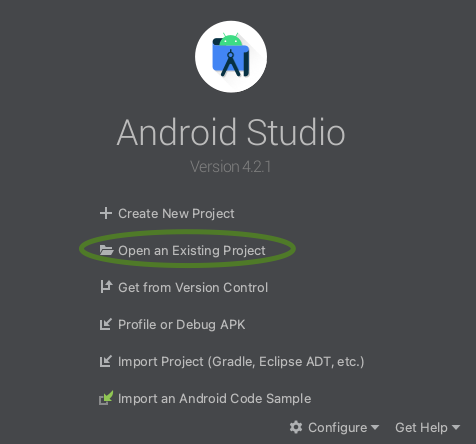

# Development Environment Setup

This page describes software and configuration required to work on code in the
[Firebase/firebase-android-sdk](https://github.com/firebase/firebase-android-sdk)
repository.

{:toc}

## JDK

The currently required version of the JDK is `11`. Any other versions are
unsupported and using them could result in build failures.

## Android Studio

In general, the most recent version of Android Studio should work. The version
that is tested at the time of this writing is `Dolphin | 2021.3.1`.

Download it here:
[Download Android Studio](https://developer.android.com/studio)

## Emulators

If you plan to run tests on emulators(you should), you should be able to install
them directly from Android Studio's AVD manager.

## Github (Googlers Only)

To onboard and get write access to the github repository you need to have a
github account fully linked with [go/github](http://go/github).

File a bug using this
[bug template](http://b/issues/new?component=312729&template=1016566) and wait
for access to be granted.

After that configure github keys as usual using this
[Github documentation page](https://docs.github.com/en/github/authenticating-to-github/connecting-to-github-with-ssh).

## Importing the repository

1. Clone the repository with `git clone --recurse-submodules
    git@github.com:firebase/firebase-android-sdk.git`.
1. Open Android Studio and click "Open an existing project".
    
1. Find the `firebase-android-sdk` directory and open.
1. To run integration/device tests you will need a `google-services.json` file.
