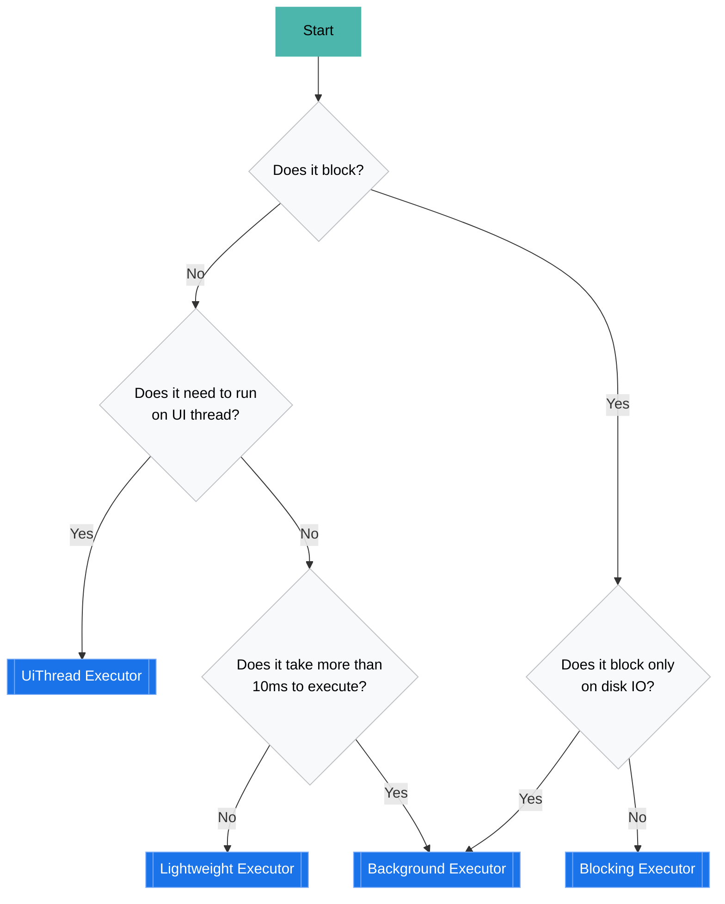

# Intro

OS threads are a limited resource that needs to be used with care. In order to minimize the number of threads used by Firebase
as a whole and to increase resource sharing Firebase Common provides a set of standard
[executors](https://developer.android.com/reference/java/util/concurrent/Executor)
and [coroutine dispatchers](https://kotlinlang.org/api/kotlinx.coroutines/kotlinx-coroutines-core/kotlinx.coroutines/-coroutine-dispatcher/)
for use by all Firebase SDKs.

These executors are available as components and can be requested by product SDKs as component dependencies.

Example:
```java
public class MyRegistrar implements ComponentRegistrar {
  public List<Component<?>> getComponents() {
    Qualified<Executor> backgroundExecutor = Qualified.qualified(Background.class, Executor.class);
    Qualified<ExecutorService> liteExecutorService = Qualified.qualified(Lightweight.class, ExecutorService.class);
    
    return Collections.singletonList(
      Component.builder(MyComponent.class)
        .add(Dependency.required(backgroundExecutor))
        .add(Dependency.required(liteExecutorService))
        .factory(c -> new MyComponent(c.get(backgroundExecutor), c.get(liteExecutorService)))
        .build());
  }
}
```

All executors(with the exception of `@UiThread`) are available as the following interfaces:

* `Executor`
* `ExecutorService`
* `ScheduledExecutorService`
* `CoroutineDispatcher`

`@UiThread` is provided only as a plain `Executor`.

## Validation

All SDKs have a custom linter check that detects creation of thread pools and threads,
this is to ensure SDKs use the above executors instead of creating their own.

# Choose the right executor

Use the following diagram to pick the right executor for the task you have at hand.



## UiThread

Used to schedule tasks on application's UI thread, internally it uses a Handler to post runnables onto the main looper.

Example:

```java
Qualified<Executor> uiExecutor = Qualified.qualified(UiThread.class, Executor.class);
```

```kotlin
Qualified<CoroutineDispatcher> dispatcher = Qualified.qualified(UiThread.class, CoroutineDispatcher.class);
```

## Lightweight

Use for tasks that never block and don't take to long to execute. Backed by a thread pool of N threads
where N is the amount of parallelism available on the device(number of CPU cores)

Example:

```java
Qualified<Executor> liteExecutor = Qualified.qualified(Lightweight.class, Executor.class);
```

```kotlin
Qualified<CoroutineDispatcher> dispatcher = Qualified.qualified(Lightweight.class, CoroutineDispatcher.class);
```

## Background

Use for tasks that may block on disk IO(use `@Blocking` for network IO or blocking on other threads).
Backed by 4 threads.

Example:

```java
Qualified<Executor> bgExecutor = Qualified.qualified(Background.class, Executor.class);
```

```kotlin
Qualified<CoroutineDispatcher> dispatcher = Qualified.qualified(Background.class, CoroutineDispatcher.class);
```

## Blocking

Use for tasks that can block for arbitrary amounts of time, this includes network IO.

Example:

```java
Qualified<Executor> blockingExecutor = Qualified.qualified(Blocking.class, Executor.class);
```

```kotlin
Qualified<CoroutineDispatcher> dispatcher = Qualified.qualified(Blocking.class, CoroutineDispatcher.class);
```
